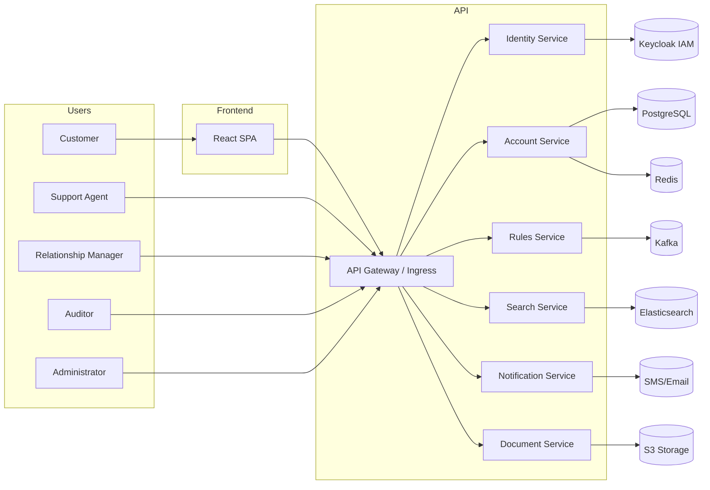

## Executive Summary

The Financial Services Customer Interaction Portal (FSCIP) is designed as a cloud-native platform that begins with a **modular monolith** architecture today, with a clear, incremental path to a **microservices** landscape as scale and complexity grow. This approach balances early-stage simplicity and rapid delivery with a robust evolution strategy for long-term scalability and team autonomy.

---

## System Context

FSCIP serves both external users (Customers) and internal roles (Support Agents, Relationship Managers, Auditors, Administrators) and integrates with:

* **Identity & Access**: Keycloak (OIDC) for SSO, 2FA, and role management
* **Core Banking System**: Downstream account and transaction data via synchronous APIs and Kafka events
* **KYC Vendor**: External ID verification for uploaded documents
* **Notification Providers**: SMS/Email gateways for OTPs, alerts, and notifications
* **Data Stores**:

  * PostgreSQL 16 for transactional data and relational consistency
  * Redis for caching hot data (e.g., session tokens, rule-validation results)
  * Elasticsearch 8 for global and advanced search capabilities
  * S3 for document storage (statements, KYC docs, PDFs)
* **Messaging**: Apache Kafka for asynchronous decoupling of heavy workflows (e.g., audit logging, document indexing)
* **Observability**: OpenTelemetry, Grafana, Loki, and Tempo for metrics, logs, and tracing

---

## Initial Deployment Approach: Modular Monolith

### Rationale

* **Rapid Delivery & Simplicity**: A single deployable artifact (uber-jar/container) accelerates the build-test-deploy cycle.
* **Low Operational Overhead**: Service discovery, distributed tracing, and inter-service auth are deferred until later.
* **Strong Consistency**: Single ACID transactions span all modules, simplifying data integrity.
* **Team Alignment**: Early-stage teams can develop cross-functional features within a shared codebase, reducing context-switching.

### Structure

* **Multi-Module Layout** (Maven):

  * `identity-module`
  * `account-module`
  * `notification-module`
  * `document-module`
  * `rules-module`
  * `search-module`
  * `common-lib`
* **Single Spring Boot Application**: Exposes all APIs via a unified API Gateway internal router.
* **Shared Database**: One PostgreSQL schema, with clear table prefixes per module.
* **Database Connection Pooling (Monolith Phase):** Configure HikariCP with `minimumIdle=5`, `maximumPoolSize=20`, and `leakDetectionThreshold` to catch leaks; tune pools per schema as load grows.

---

## Evolution Strategy: Strangler‐Fig to Microservices

1. **Pilot Extraction**: Carve out a low-risk domain (e.g., Search, Notifications) into an independent service behind the API Gateway; enforce consumer-driven contracts (Pact).
2. **Incremental Migration**: Use feature flags for traffic routing; implement dual-write logic and zero-downtime data migration scripts.
3. **Independent CI/CD**: Provision per-service GitHub Actions pipelines via monorepo scaffolding, Docker image builds, and Helm deploys.
4. **Distributed Patterns**: Adopt sagas or event-driven compensations; integrate Resilience4j for circuit breakers and retries.
5. **Full Microservices**: Continue extracting bounded contexts until each service owns its schema, code, and pipeline.

---

## Component Diagrams & Module Breakdown

* **identity-service**: Registration, OTP, Password Reset, Login, Profile, 2FA, Admin Role Management; integrates Keycloak, Redis, PostgreSQL, Kafka.
* **account-service**: Account Summary, Transactions, Export, Trends, Alerts, Mini‐Statements; integrates Core Banking APIs, PostgreSQL, Redis, S3, Kafka.
* **rules-service**: Rule Administration, Validation, Simulation, Versioning, Dependency Graph; integrates Drools, PostgreSQL, Redis, Kafka.
* **search-service**: Global Search, Advanced Search, Suggestions, History, Reindex; integrates Elasticsearch, PostgreSQL, Kafka.
* **notification-service**: Email, SMS, In‐app Notifications; integrates external SMS/Email APIs, PostgreSQL, Kafka.
* **document-service**: Upload, Download, Preview, Export, OCR Pipeline; integrates S3, Tika/OCR, Elasticsearch, Kafka.
* **common-lib**: Security (JWT, CSRF), DTO mapping (MapStruct), Error Handling, Logging, Metrics.
* OpenAPI/Swagger for all services.

---

## Data Model Overview

* **Users & Auth**: `users` → `user_roles`, `otp_codes`, `password_reset_tokens`, `consents`, `login_history`
* **Accounts & Transactions**: `accounts` → `transactions`, `alerts`
* **Applications**: `products` → `questionnaire_schemas`; `applications` → `application_documents`, `application_history`
* **Service Requests**: `tickets` → `ticket_messages` → `message_attachments`, `ticket_feedback`
* **Investments**: `investments` → `sip_schedules`, `investment_history`, `maturity_alerts`
* **Secure Messaging**: `threads` → `thread_participants` → `messages` → `message_attachments`
* **Rules Engine**: `rulesets` → `rule_versions` → `rule_evaluations`, `rule_change_log`
* **Search & Audit**: `search_history`, `audit_log`
* **Documents & KYC**: `documents` → `kyc_documents`

---

## Integration Flows

1. **Customer Registration & Activation**

   * `POST /auth/register` → pending user record → OTP via SMS/Email
   * `POST /auth/otp/verify` → activate user → audit event
   * `POST /auth/login` → JWT + Refresh Token issuance
2. **Account Overview & Transactions**

   * `GET /accounts/summary` → dashboard data
   * `GET /transactions` → paginated, filterable list
   * WebSocket for real-time balance updates
3. **Product Application**

   * `GET /products` → product catalog + `/products/{id}/questionnaire-schema`
   * `POST /applications` → create application → referenceNo
   * `GET /applications/{id}` → status timeline via polling or WS
4. **Service Request Management**

   * `POST /tickets` → new ticket + attachments
   * `GET /tickets/{id}/timeline` → full conversation
   * WS pushes for agent replies; `POST /tickets/{id}/close` with feedback

---

## Non-Functional Requirements

*(Performance, Security, Observability apply across both phases.)*

**Performance SLAs by Phase**

| Metric                     | Monolith Phase | Hybrid Phase | Microservices Phase |
| -------------------------- | -------------- | ------------ | ------------------- |
| API Response Time (P95)    | < 250 ms       | < 220 ms     | < 200 ms            |
| Rule Validation (P95)      | < 350 ms       | < 320 ms     | < 300 ms            |
| Search Queries (P95)       | < 550 ms       | < 500 ms     | < 450 ms            |
| Transaction Throughput     | 200 TPS        | 300 TPS      | 500 TPS             |
| DB Conn. Acquisition (P95) | < 15 ms        | < 12 ms      | < 10 ms             |

---

### Error Handling & Resilience

* **Uniform Exception Model**: Shared `ErrorResponse` DTO with codes, messages, trace IDs via centralized handler.
* **Module Adapters**: Interfaces per module map internal exceptions to `ServiceException`/`ValidationException`.
* **Circuit Breaker & Retry**: Resilience4j with 3 retries, 500 ms backoff, 50% failure threshold in monolith.
* **Correlation & Context Propagation**: Trace IDs in HTTP headers and Kafka metadata for end-to-end tracing.

---

## CI/CD Strategy

* **Monolith Pipeline**: Unified GitHub Actions workflow for build, test, Docker, deploy.
* **Service Pipelines**: Template‐driven GitHub Actions per extracted service.
* **Environments**: `local`, `dev`, `qa`, `prod` via Helm charts and Kubernetes.
* **Testing Pyramid**: Enforce unit, contract (Pact), integration, and E2E layers with coverage gates.

---

## Additional Design Considerations

### Frontend

* **Modular Component Library**: Shared `ui-components` for reuse and consistency.
* **Micro‐Frontend Readiness**: Shell architecture enabling Webpack Module Federation or single‐spa integrations.
* **Feature State Isolation**: Redux Toolkit slices per feature to simplify future extrication.
* **Design Tokens**: Centralized Tailwind/CSS variables for theming.

### Backend

* **API Gateway Abstraction**: Kong/Istio for rate limiting, auth, versioning of public contracts.
* **Domain‐Driven Bounded Contexts**: Package-level boundaries now to ease service splits.
* **Pluggable Persistence**: Repository interfaces + Flyway for DB-agnostic migration.
* **Event Schema Standardization**: Avro/Protobuf contracts for Kafka events.

### Database

* **Logical Schema Partitioning**: PostgreSQL schemas per domain.
* **Polyglot Persistence Roadmap**: Adapter layer for specialized stores (TSDB, graph).
* **Multi‐Region Replication**: Plan for read replicas and cross-region DR.
* **Archival Strategy**: Partitioned tables and cold storage for aged data.

### Integration & Cross‐Cutting

* **Contract‐First Development**: OpenAPI/gRPC IDLs with CI contract validation.
* **Observability by Design**: Auto-instrumented tracing, metrics, and structured logs.
* **Security as Code**: OPA/Istio policies reviewable via Git.
* **Feature Flag Governance**: Lifecycle rules to avoid stale flags.
* **Performance & Security Testing**: Nightly Gatling and OWASP ZAP in QA.

---

*These guidelines ensure FSCIP remains adaptable, maintainable, and resilient as it evolves.*
